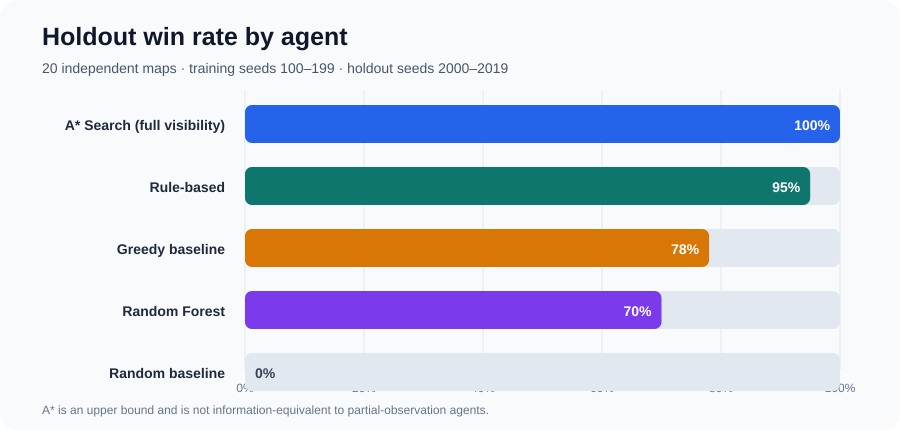
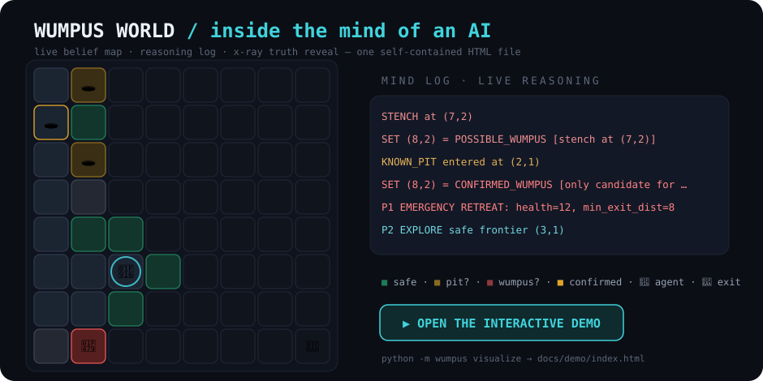

<div dir="rtl">

# 🏆 Wumpus World AI — شبیه‌ساز و بنچمارک سه روش هوش مصنوعی

[](https://github.com/mahan-vzmz/Wumpus-World/actions/workflows/ci.yml)


یک پروژهٔ دانشگاهی مهندسی‌شده برای پیاده‌سازی و مقایسهٔ سه پارادایم متفاوت هوش مصنوعی در محیط `8×8` دنیای Wumpus:

- 🎯 **عامل A\* Search:** با دید کامل از نقشه، به‌عنوان خبره و کران بالای عملکرد؛
- 🧠 **استدلال قاعده‌محور (Rule-based):** با دید ناقص و trace قابل‌توضیح بر اساس پایگاه دانش؛
- 🤖 **یادگیری نظارت‌شده (Random Forest):** با ویژگی‌های صرفاً مشاهده‌پذیر و Action Masking.

دو baseline حریصانه (Greedy) و تصادفی (Random) نیز برای تفسیر بهتر نتایج اجرا می‌شوند. تمام عامل‌ها از موتور بازی، قرارداد امتیاز و مجموعهٔ نقشهٔ مشترک استفاده می‌کنند.

---

## 📊 نتایج نهایی روی مجموعهٔ Holdout

مدل روی ۱۰۰ نقشهٔ تولیدی با seedهای `100..199` آموزش دیده و ارزیابی نهایی روی ۲۰ نقشهٔ holdout جدا (seedهای تولید `2000..2019`) انجام شده که در انتخاب مدل استفاده نشده است. هر عامل روی این ۲۰ نقشه با **۵ seed مستقل** (جمعاً **۱۰۰ episode**) اجرا شده و **فاصلهٔ اطمینان ۹۵٪** با bootstrap روی نقشه‌ها گزارش می‌شود. ستون‌های «ورود به چاه» و «مرگ با غول» مجموع روی هر ۱۰۰ episode هستند.

| عامل | میزان مشاهده | نرخ برد (۹۵٪ CI) | امتیاز تشخیصی | امتیاز نهایی (برد) | میانگین گام | ورود به چاه | مرگ با غول |
| :--- | :---: | :---: | ---: | ---: | ---: | ---: | ---: |
| **A\* Search** | Full | **100%** [100–100] | **41.6** | 41.6 | 14.9 | **0** | **0** |
| **Rule-based** | Partial | **95%** [85–100] | 24.3 | 25.3 | 21.3 | 7 | **0** |
| **Greedy baseline** | Partial | 78% [65–88] | 21.6 | 21.8 | **12.6** | 37 | 19 |
| **Random Forest** | Partial | 70% [50–90] | 13.7 | 21.6 | 19.4 | 35 | **0** |
| **Random baseline** | Partial | 0% [0–0] | -3.6 | — | 31.9 | 71 | 15 |

> 📌 **نکته ۱:** مقایسهٔ A\* با عامل‌های آنلاین هم‌شرایط نیست: A\* نقشهٔ پنهان را می‌بیند و فقط نقش خبره/کران بالا دارد. مقایسهٔ منصفانهٔ آنلاین میان RuleAgent، MLAgent و baselineها است.
>
> 📌 **نکته ۲ (تفسیر آماری):** RuleAgent با CI `[85–100]` به‌روشنی بهترین عامل آنلاین است. اما CIهای MLAgent `[50–90]` و Greedy `[65–88]` **همپوشانی زیادی دارند**؛ پس با ۲۰ نقشه نمی‌توان گفت تفاوت این دو معنی‌دار است. نکتهٔ ایمنی: MLAgent با ماسک‌گذاری آگاه از خطر **صفر مرگ با غول** دارد، برخلاف Greedy.

نتایج خام و مشخصات اجرای ثبت‌شده در [`results/`](results/) قرار دارند.



---

## 🎮 دموی تعاملی — پنج ذهن، یک سیاه‌چال

هر پنج عامل را روی نقشه‌های یکسان گام‌به‌گام تماشا و با سوییچر **MIND** مقایسه کنید: **نقشهٔ باور زنده** برای عامل‌های دانش‌محور (امن / چاهِ مشکوک / غولِ مشکوک / قطعی)، **لاگ استدلال هم‌زمان**، آمار برنامه‌ریز A\* (با نشان «FULL MAP» و X-ray همیشه‌روشن — چون همه‌چیز را می‌بیند)، ردپای baselineها، و دکمهٔ **X-ray** برای مقایسهٔ باور با حقیقتِ پنهان — روی ۶ نقشه از آسان تا مرگبار، در **یک فایل HTML خودکفا** (بدون سرور، بدون کتابخانه؛ کافی است دابل‌کلیک کنید).

<div dir="ltr">

[](docs/demo/index.html)

</div>

بازتولید و اجرا:

<div dir="ltr">

```bash
python -m wumpus visualize      # builds docs/demo/index.html
start docs/demo/index.html      # Windows — or just double-click the file
```

</div>

> 💡 با فعال‌کردن GitHub Pages روی پوشهٔ `docs/`، دمو به‌صورت آنلاین در `https://mahan-vzmz.github.io/Wumpus-World/demo/` در دسترس قرار می‌گیرد.

---

## 🏗️ معماری ساختار پروژه

<div dir="ltr">

```text
src/wumpus/
├── core/                  # Simulator core & game rules
│   ├── domain.py          # Domain models (Position, GameMap, GameState)
│   ├── engine.py          # Transition logic & event ordering (step)
│   ├── observation.py     # Percept generation (breeze, stench, glitter)
│   ├── parser.py          # Map parsing & validation
│   ├── generator.py       # Solvable map generator
│   └── runner.py          # Episode execution loop & error handling
├── ai/                    # AI algorithms & data pipeline
│   ├── search.py          # Score-optimal A* with terminal cost
│   ├── knowledge.py       # Logical KnowledgeBase & forward chaining
│   ├── encoder.py         # 397-dim observation feature encoder
│   ├── dataset.py         # Demonstration generation & map-split
│   └── ml.py              # ML model training, metrics & action masking
├── agents/                # Agents (Search / Rule / ML / Greedy / Random)
├── evaluation/            # Benchmark suite runner & generator
├── cli.py                 # Command line interface (CLI)
└── __main__.py            # Python entrypoint
```

</div>

---

## 🚀 نصب سریع

**پیش‌نیاز:** Python 3.11 یا جدیدتر.

۱) دریافت پروژه و ورود به دایرکتوری:
<div dir="ltr">

```bash
git clone https://github.com/mahan-vzmz/Wumpus-World.git
cd Wumpus-World
```

</div>

۲) ساخت و فعال‌سازی محیط مجازی:
<div dir="ltr">

```bash
python -m venv .venv
source .venv/bin/activate          # Windows: .venv\Scripts\activate
```

</div>

۳) نصب نیازمندی‌ها:
<div dir="ltr">

```bash
python -m pip install -e ".[dev]"
```

</div>

---

## 🧪 اجرای تست و کنترل کیفیت

اجرای تست‌های خودکار، بررسی نگارشی و میزان پوشش کد:
<div dir="ltr">

```bash
pytest
ruff check .
pytest --cov=wumpus --cov-report=term-missing
```

</div>

- **۱۳۷ تست خودکار** سبزرنگ؛
- **پوشش ۹۳.۹۴٪** برای کد هسته؛
- تست و بررسی خودکار روی Python 3.11 و 3.12 در GitHub Actions.

---

## 🕹️ اجرای نمونه

اعتبارسنجی نقشه:
<div dir="ltr">

```bash
python -m wumpus validate --input data/maps/example.txt
```

</div>

اجرای عامل A* با دید کامل:
<div dir="ltr">

```bash
python -m wumpus run --agent search --input data/maps/example.txt
```

</div>

اجرای عامل قاعده‌محور با trace استدلال:
<div dir="ltr">

```bash
python -m wumpus run --agent rules --input tests/fixtures/golden2_pit.txt --trace
```

</div>

اجرای baselineها:
<div dir="ltr">

```bash
python -m wumpus run --agent greedy --input data/maps/example.txt
python -m wumpus run --agent random --input data/maps/example.txt --seed 42
```

</div>

---

## 🔄 بازتولید چرخهٔ ML و Benchmark

> ⚠️ **مهم:** فایل باینری مدل عمداً داخل Git نگهداری نمی‌شود؛ دیتاست، تنظیمات، معیارها و دستور بازتولید ثبت شده‌اند.

۱) بازتولید ۱۰۰ نقشهٔ آموزشی متنوع و demonstrationهای A*:
<div dir="ltr">

```bash
python -m wumpus dataset --num-maps 100 --seed 100 --output-dir data/processed
```

</div>

۲) آموزش و ذخیرهٔ مدل و معیارهای validation/test:
<div dir="ltr">

```bash
python -m wumpus train --data-dir data/processed --output-dir artifacts/models
```

</div>

۳) اجرای benchmark نهایی روی holdout ثابت:
<div dir="ltr">

```bash
python -m wumpus benchmark --maps-dir data/maps/holdout_suite --model artifacts/models/random_forest.joblib --results-dir results --seeds 42 123 777 2024 31337
```

</div>

اگر فقط عامل‌های غیر ML مدنظر باشند:
<div dir="ltr">

```bash
python -m wumpus benchmark --skip-ml
```

</div>

در صورت نبود مدل، CLI به‌جای اجرای یک fallback خاموش با پیام روشن و exit code غیرصفر متوقف می‌شود.

---

## 📄 قالب ورودی

ورودی شامل ۸ سطر نقشه و چهار مقدار تنظیمات است:

<div dir="ltr">

```text
********
**D*****
*****G**
W***P***
********
********
********
********
100
25
-10
8 8
```

</div>

نمادها: `*` خانهٔ خالی، `P` چاه، `W` غول، `D` دیوار و `G` طلا. مختصات بیرونی یک‌مبنا و به‌شکل `(row, column)` هستند.

---

## 📂 بازتولیدپذیری و داده‌های ثبت‌شده

- **فایل متادیتا ([`data/processed/metadata.json`](data/processed/metadata.json)):** شامل schema، تعداد نمونه‌ها، profileها و توزیع کلاس‌ها؛
- **معیارهای مدل ([`artifacts/models/training_metrics.json`](artifacts/models/training_metrics.json)):** معیارهای validation/test و confusion matrix؛
- **پیکربندی Holdout ([`data/maps/holdout_suite/suite_manifest.json`](data/maps/holdout_suite/suite_manifest.json)):** seed و تنظیمات مجموعهٔ ارزیابی؛
- **نتایج خام ([`results/benchmark_results.csv`](results/benchmark_results.csv)):** ۱۰۰ ردیف دادهٔ خام اجرای نهایی؛
- **خلاصهٔ ارزیابی ([`results/benchmark_summary.json`](results/benchmark_summary.json)):** خلاصهٔ بنچمارک، نسخهٔ Python و SHA-256 مدل.

---

## ⚠️ محدودیت‌ها

- برچسب‌های خبره از A\* با دید کامل می‌آیند، ولی MLAgent فقط observation ناقص دارد؛ بخشی از رفتار خبره ذاتاً از روی ویژگی‌های آنلاین قابل‌بازیابی نیست.
- دیتاست چهارکلاسه نامتوازن است و کلاس‌های `UP` و `LEFT` نمونه‌های کمتری دارند؛ بنابراین macro-F1 و recall هر کلاس در کنار accuracy گزارش شده‌اند.
- `glitter` طبق قرارداد پروژه وجود دارد، اما چون طلا هنگام ورود خودکار جمع می‌شود، در episode عادی سیگنال تصمیم‌گیری فعالی نیست.
- اعداد زمان اجرا به سخت‌افزار و نسخهٔ کتابخانه‌ها وابسته‌اند؛ نتیجه‌گیری اصلی بر win rate، score و معیارهای ایمنی است.
- ارزیابی روی ۵ seed مستقل با فاصلهٔ اطمینان ۹۵٪ (bootstrap روی نقشه‌ها) گزارش می‌شود، اما مجموعهٔ holdout همچنان تنها ۲۰ نقشه دارد؛ برای ادعای تعمیم قوی‌تر، افزایش تعداد نقشه‌های holdout گام بعدی است.

---

## 📚 مستندات

- **مجوز پروژه ([`LICENSE`](LICENSE)):** مجوز MIT برای استفاده و توسعهٔ پروژه؛
- **محیط و تصمیمات ([`docs/PROJECT_CONTEXT.md`](docs/PROJECT_CONTEXT.md)):** قراردادها و دفتر تصمیم‌ها؛
- **مشخصات فنی ([`docs/SPEC.md`](docs/SPEC.md)):** مشخصات فنی و رفتاری سیستم؛
- **گزارش جامع ([`docs/PROJECT_REPORT.md`](docs/PROJECT_REPORT.md)):** گزارش روش‌ها و تحلیل نتایج بنچمارک؛
- **دفترچه تسک‌ها ([`docs/TASKBOOK.md`](docs/TASKBOOK.md)):** وضعیت اجرایی و کارهای باقی‌مانده؛
- **سناریوی ارائه ([`docs/DEMO.md`](docs/DEMO.md)):** سناریوی ارائهٔ ۵ دقیقه‌ای؛
- **مثال‌های گام‌به‌گام ([`tests/fixtures/GOLDEN_EXAMPLES.md`](tests/fixtures/GOLDEN_EXAMPLES.md)):** مثال‌های دستی حرکت‌به‌حرکت.

</div>
